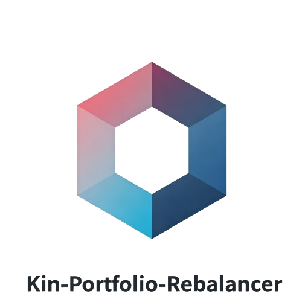

<h3 align="center">
  
</h3>

<div align="center">
  <h1>Kin-Portfolio-Rebalancer</h1>
</div>

<p align="center">Cross-platform automated portfolio rebalancer based on the Gate.io API<br>跨平台投资组合再平衡机器人，基于Gate.io交易所API</p>

<p align="center">

</p>


Read this in [简体中文](https://github.com/btxLithium/Kin-Portfolio-Rebalancer/blob/main/docs/README.Hans.md) | [繁體中文](https://github.com/btxLithium/Kin-Portfolio-Rebalancer/blob/main/docs/README.Hant.md)

## Features

- Threshold-based Rebalancing: Automatically adjusts the portfolio when asset allocation deviates from the target percentage by a set threshold.
- Cash Flow Rebalancing: Automatically adjusts the portfolio when new stablecoins (USDT or USDC) are received.
- Cross-platform desktop GUI built with Rust (egui).
- Python backend handles api keys encryption, communication with Gate.io exchange and rebalancing logic.

## What is a portfolio rebalancer?

A portfolio rebalancer is an automated tool that monitors your cryptocurrency holdings and adjusts them to maintain a predetermined asset allocation. 
It automatically executes trades to buy or sell assets when market fluctuations cause your portfolio to deviate from your target ratios.

## Usage

### Pre-built executables

See the
[releases page](https://github.com/jtroo/kanata/releases)
for executables.

### Build it yourself

This project uses the latest Rust stable toolchain. If you installed the
Rust toolchain using `rustup`, e.g. by using the instructions from the
[official website](https://www.rust-lang.org/learn/get-started),
you can get the latest stable toolchain with `rustup update stable`.

<details>
<summary>Instructions</summary>

Using `cargo install`:

    cargo install kanata

    # On Linux and macOS, this might not work without `sudo`,

Build and run yourself in Linux:

    git clone https://github.com/jtroo/kanata && cd kanata
    cargo build  


Build and run yourself in Windows.

    git clone https://github.com/jtroo/kanata; cd kanata
    cargo build   

</details>


## Structure

```
portfolio-rebalancer/
├── backend/         # Python后端
│   ├── api/         # Gate.io API客户端和工具
│   ├── config/      # 配置设置
│   ├── models/      # 数据模型
│   ├── services/    # 再平衡服务
│   └── main.py      # 主程序入口
├── frontend/        # Rust前端

```


## What does the name mean?

"kin" is the reading of the character "鈞", an ancient Chinese unit of weight. 

## Donations

If you'd like to support my work, consider buy me a coffee:

- USDT or USDC Aptos:  
0x675422152a1dcb2eba3011a5f2901d9756ca7be872db10caa3a4dd7f25482e8e  
- USDT or USDC BNB Smart Chain:  
0xbe9c806a872c826fb817f8086aafa26a6104afac  